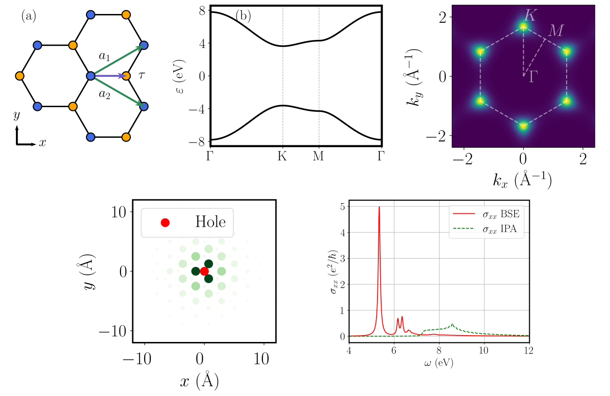

.. Xatu documentation master file

.. _Xatu: https://github.com/xatu-code/xatu

==========================================
Xatu: eXcitons from ATomistic calcUlations
==========================================

`Xatu`_ solves the **Bethe–Salpeter equation (BSE)** for excitons in crystals, starting from
electronic structures built on **localized orbitals**: tight-binding models, Wannier90 Hamiltonians, or
DFT calculations with the CRYSTAL code.

It can be used as a command-line program or as a C++ library. From the exciton spectrum it computes
optical absorption, exciton wavefunctions in real and reciprocal space, spin, and the microscopic
screening of 2D materials.

.. admonition:: Reference paper
   :class: tip

   A. J. Uría-Álvarez, J. J. Esteve-Paredes, M. A. García-Blázquez and J. J. Palacios,
   `Efficient computation of optical excitations in two-dimensional materials with the Xatu code,
   Computer Physics Communications 295, 109001 (2024) <https://doi.org/10.1016/j.cpc.2023.109001>`_.
   Please :doc:`cite it <miscellaneous/citing>` if you use Xatu.

Where to start
==============

.. grid:: 1 2 2 2
   :gutter: 3

   .. grid-item-card:: :octicon:`download` Installation
      :link: installation
      :link-type: doc

      Dependencies, building Xatu on Linux and macOS, and optional HDF5 support.

   .. grid-item-card:: :octicon:`rocket` Quick start
      :link: quickstart
      :link-type: doc

      Excitons and optical absorption of monolayer hBN, from the input files to the plots, in under
      a second.

   .. grid-item-card:: :octicon:`terminal` Command line
      :link: usage
      :link-type: doc

      Every flag of the ``xatu`` binary and the common recipes.

   .. grid-item-card:: :octicon:`file-code` Input files
      :link: input_files
      :link-type: doc

      System, exciton, screening and absorption files: every keyword, with defaults.

   .. grid-item-card:: :octicon:`file` Output files
      :link: outputs/overview
      :link-type: doc

      What each output file contains, its format and units.

   .. grid-item-card:: :octicon:`book` Theory
      :link: methods/BSE
      :link-type: doc

      The BSE, the interaction potentials and the optical conductivity as implemented in Xatu.

.. note::

   **Two development lines.** Some features currently exist in only one version of Xatu. They are
   marked with a badge:

   * |w90| — improved Wannier90 support (degenerate-state handling, ``-t/--ecut``, ``.rswf`` with
     :math:`z` coordinates);
   * |scr| — the microscopic RPA screening (``-z`` flag, ``rpa`` potential, ``# gcutoff``).

   Everything without a badge works the same in both.

.. toctree::
   :hidden:
   :caption: Getting started

   installation
   quickstart
   usage

.. toctree::
   :hidden:
   :caption: Input files

   input_files

.. toctree::
   :hidden:
   :caption: Output files

   outputs/overview
   outputs/eigval
   outputs/states
   outputs/kwf
   outputs/rswf
   outputs/spin
   outputs/conductivity
   outputs/oscillator_strengths
   outputs/invpesilon

.. toctree::
   :hidden:
   :caption: Theory

   methods/BSE
   methods/screening
   methods/optical_properties

.. toctree::
   :hidden:
   :caption: Reference

   miscellaneous/api
   miscellaneous/citing
   miscellaneous/license
