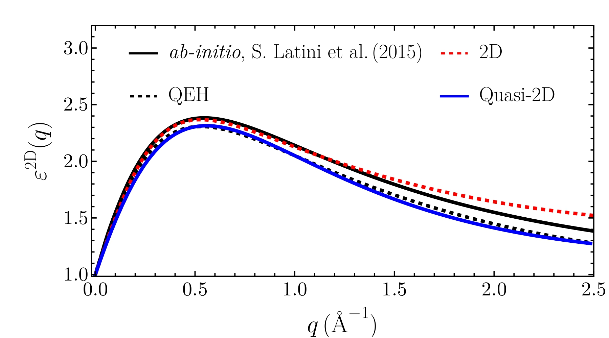

=========================
Interaction and screening
=========================

The direct term of the BSE kernel uses an electron–hole interaction potential, chosen with
``# potential`` in the exciton file.

.. list-table::
   :header-rows: 1
   :widths: 22 20 58

   * - ``# potential``
     - Methods
     - Description
   * - ``keldysh`` *(default)*
     - real & reciprocal
     - Rytova–Keldysh potential: a 2D layer screened by its environment.
   * - ``coulomb``
     - real & reciprocal
     - Bare Coulomb potential.
   * - ``rpa``
     - reciprocal only
     - Numerical RPA screened potential computed from the band structure.

Coulomb potential
=================

.. math::

   V(\bm{r}) = \frac{e^2}{4 \pi \varepsilon_0 |\bm{r}|}

In real space it is regularized at :math:`r = 0` (``# regularization``) and truncated beyond a cutoff
distance set from the lattice parameter. Use it when long-range, unscreened interactions are wanted.

Rytova–Keldysh potential
========================

This potential describes a 2D material of screening length :math:`r_0`, between a substrate
:math:`\varepsilon_s` and a medium :math:`\varepsilon_m`:

.. math::

   V(r) = -\frac{e^2}{8 \varepsilon_0 \bar{\varepsilon} r_0}
   \left[ H_0\!\left(\frac{r}{r_0}\right) - Y_0\!\left(\frac{r}{r_0}\right) \right],
   \qquad \bar{\varepsilon} = \frac{\varepsilon_m + \varepsilon_s}{2},

where :math:`H_0` is the Struve function and :math:`Y_0` the Bessel function of the second kind. The
parameters come from ``# dielectric eps_s eps_m r0``. Like the Coulomb potential, it is regularized at
:math:`r=0` and truncated at long distances.

Anisotropic screening
---------------------

Xatu extends the Rytova–Keldysh model to **anisotropic** screening lengths,
:math:`\bm{r}_0 = (r_0^x, r_0^y, r_0^z)`, given as ``# dielectric eps_s eps_m r0x r0y r0z``. The
coordinates are rescaled accordingly, so the screening can differ along each direction. This
generalization goes beyond the usual isotropic model.

Numerical RPA screening
=======================

Instead of a model potential, Xatu can compute the microscopic RPA dielectric matrix of the material
itself, in its symmetric form:

.. math::

   \epsilon_{\bm{G}\bm{G}'}(\bm{q}) = \delta_{\bm{G}\bm{G}'}
   - \sqrt{v_c(\bm{q}+\bm{G})}\; \chi^0_{\bm{G}\bm{G}'}(\bm{q})\; \sqrt{v_c(\bm{q}+\bm{G}')} ,

where :math:`v_c(\bm{q}) = e^2/(2\varepsilon_0|\bm{q}|)` is the 2D Fourier transform of the Coulomb
potential. :math:`\chi^0` is the independent-particle polarizability, which for gapped,
time-reversal-symmetric systems reads

.. math::

   \chi^0_{\bm{G}\bm{G}'}(\bm{q}) = \frac{2}{A} \sum_{vc,\bm{k}\sigma}
   \frac{\langle c,\bm{k}| e^{-i(\bm{q}+\bm{G})\cdot\bm{r}}|v,\bm{k}+\bm{q}\rangle\,
         \langle v,\bm{k}+\bm{q}| e^{i(\bm{q}+\bm{G}')\cdot\bm{r}}|c,\bm{k}\rangle^*}
        {\epsilon_{v,\bm{k}+\bm{q}} - \epsilon_{c,\bm{k}}} .

The matrix elements are evaluated for Bloch states in the LCAO basis, within the point-like orbital
approximation. The sum runs over ``# valence.bands`` and ``# conduction.bands`` on an auxiliary mesh of
``# ncell_aux`` points. If a thickness :math:`d_\perp` is given, the quasi-2D dielectric matrix
:math:`\bar{\epsilon}_{\bm{G}\bm{G}'}(\bm{q})` is computed instead (see :doc:`BSE`).

The inverse :math:`\epsilon^{-1}` enters the screened potential :math:`W` of the BSE, and can be written
to file (:doc:`../outputs/invpesilon`). All parameters are in :doc:`../input_files/screening`.

.. admonition:: Reference paper
   :class: tip

   P. Ninhos, A. J. Uría-Álvarez, C. Tserkezis, N. A. Mortensen and J. J. Palacios,
   `Microscopic screening theory for excitons in two-dimensional materials: A bridge between effective
   models and ab initio descriptions, arXiv:2603.10966 <https://arxiv.org/abs/2603.10966>`_.

Example: macroscopic dielectric function of hBN
-----------------------------------------------

The figure shows the macroscopic dielectric function :math:`\epsilon_M(\bm{q}) = 1/\epsilon^{-1}_{00}(\bm{q})`
of monolayer hBN along :math:`\Gamma`-K. The red and blue curves are computed with Xatu from the CRYSTAL model
``hBN_base_HSE06.outp`` (HSE06 functional), which ships with Xatu. The continuous black curve is from
Phys. Rev. B **92**, 245123 (2015), and the dashed black curve from the QEH package (Nano Lett. **15**,
4616 (2015)).

To reproduce it, compile the ``write_screening`` script from ``main/`` (``make write_screening``). Then
run it from ``bin/`` with the system, exciton and screening files, plus a file listing the
:math:`\bm{q}`-points:

.. code-block:: bash

   ./write_screening ../examples/material_models/DFT/hBN_base_HSE06.outp \
                     ../examples/excitonconfig/hBN_reciprocal.txt \
                     ../examples/screeningconfig/hBN_DFT_screening.txt \
                     ../data/hBN_DFT_HSE06_Gamma_K_q_points.dat

The exciton file must use the reciprocal-space method (``# gcutoff``). The screening file selects 2D
or Q2D (``# thickness``). The script calls ``ExcitonTB::compute_2D_DielectricMatrix(q_points_file)``,
inverts the result, and writes ``<q_points_file>_invepsilon.dat`` in the format of
:doc:`../outputs/invpesilon`.
