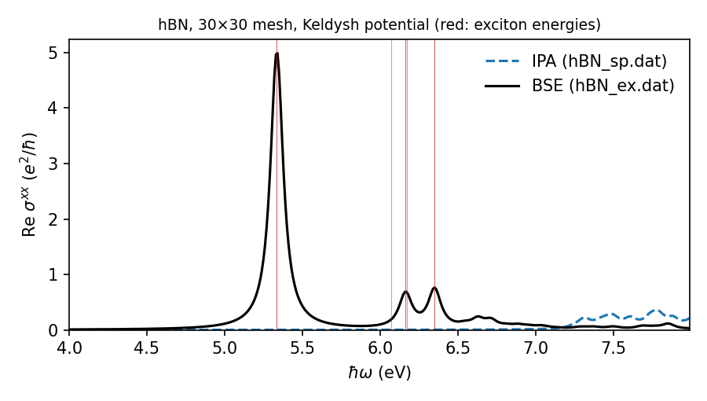
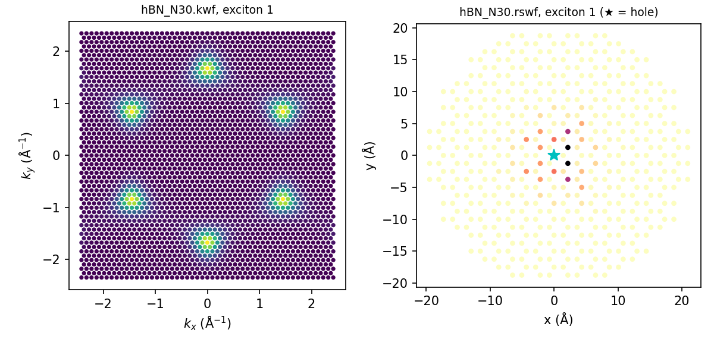

===========
Quick start
===========

This tutorial computes the excitons and optical absorption of monolayer **hBN** with a two-band
tight-binding model. It uses the example files shipped with Xatu, and runs in under a second.

We assume Xatu is built (see :doc:`installation`) and that you work from a fresh directory:

.. code-block:: bash

   mkdir hbn && cd hbn
   cp /path/to/xatu/examples/material_models/hBN.model .
   cp /path/to/xatu/examples/excitonconfig/hBN_spinless.txt .

1. The system file
==================

``hBN.model`` describes the crystal and its tight-binding Hamiltonian. Every block starts with
``# name``:

.. code-block:: text

   # dimension
   2
   # norbitals
   1 1
   # bravaislattice
       2.165060     1.250000     0.000000
       2.165060    -1.250000     0.000000
   # motif
       0.000000     0.000000     0.000000     0.000000
       1.443376     0.000000     0.000000     1.000000
   # bravaisvectors
       0.000000     0.000000     0.000000
      -2.165060    -1.250000     0.000000
      ...
   # hamiltonian
       3.625000   +0.000000j    -2.300000   +0.000000j
      -2.300000   +0.000000j    -3.625000   +0.000000j
   &
      ...
   # filling
   1

It defines a 2D hexagonal lattice (Angstrom), with one B and one N atom carrying one orbital each. The
Hamiltonian matrices :math:`H(\bm{R})` (eV) are given for each Bravais vector :math:`\bm{R}` and
separated by ``&``, and one band is filled. All blocks are described in :doc:`input_files/system`.

2. The exciton file
===================

``hBN_spinless.txt`` sets up the BSE:

.. code-block:: text

   # label
   hBN_N30
   # ncells
   30
   # bands
   1
   # dielectric
   1 1 10

In words:

* output files are named ``hBN_N30.*``;
* the Brillouin zone is sampled with a 30x30 mesh;
* one valence and one conduction band are used;
* the electron–hole interaction is the Rytova–Keldysh potential (the default), with substrate and
  medium permittivities of 1 and a screening length :math:`r_0 = 10` Angstrom.

All keywords are listed in :doc:`input_files/exciton`.

3. Run Xatu
===========

Ask for the lowest 8 excitons (``-n 8``) and write their energies (``-e``), eigenstates (``-c``) and
k-space densities (``-k``):

.. code-block:: bash

   xatu -n 8 -e -c -k hBN.model hBN_spinless.txt

The program prints a summary of the calculation and the exciton spectrum. States with the same energy
are grouped, and their degeneracy is shown:

.. code-block:: text

   BSE dimension: 900
   Initializing Bethe-Salpeter matrix... Done
   Solving BSE with exact diagonalization... Done
   +---------------+-----------------------------+-----------------------------+
   |       N       |          Eigval (eV)        |          Degeneracy         |
   +---------------+-----------------------------+-----------------------------+
   |              1|                     5.335687|                            2|
   |              2|                     6.073800|                            1|
   |              3|                     6.164059|                            2|
   ...
   Writing eigvals to file: hBN_N30.eigval
   Writing states to file: hBN_N30.states
   Writing k w.f. to file: hBN_N30.kwf

The lowest exciton is a doubly degenerate state at 5.34 eV. This model's band gap is 7.25 eV, so the
binding energy is about 1.9 eV.

4. Optical absorption
=====================

The optical conductivity needs a small extra file, ``kubo_w.in``, in the working directory:

.. code-block:: text

   #initial frequency (eV)
   4
   #frequency range (eV)
   4
   #number of frequency points (integer)
   400
   #broadening parameter (eV)
   0.05
   #type of broadening (available: 'lorentzian', 'exponential', 'gaussian')
   lorentzian
   #output kubo name files
   hBN_sp.dat
   hBN_ex.dat

Now add ``-a``. With ``-r 0`` the real-space wavefunction is also written, with the hole fixed on atom 0:

.. code-block:: bash

   xatu -n 8 -e -c -k -r 0 -a hBN.model hBN_spinless.txt

Five new files appear: ``hBN_sp.dat`` and ``hBN_ex.dat`` hold the conductivity without and with
excitons. Their imaginary parts are in ``hBN_sp_imag.dat`` and ``hBN_ex_imag.dat``, and the exciton
oscillator strengths are in ``hBN_ex_osc.dat`` (see :doc:`outputs/conductivity`). Column 2 is
:math:`\mathrm{Re}\,\sigma^{xx}`:

.. code-block:: python

   import numpy as np, matplotlib.pyplot as plt
   sp = np.loadtxt("hBN_sp.dat"); ex = np.loadtxt("hBN_ex.dat")
   plt.plot(sp[:, 0], sp[:, 1], "--", label="IPA")
   plt.plot(ex[:, 0], ex[:, 1], label="BSE")
   plt.xlabel("ħω (eV)"); plt.ylabel("Re σxx (e²/ħ)"); plt.legend(); plt.show()

The independent-particle (IPA) spectrum starts at the band gap. With excitons (BSE), the weight moves to
a strong peak at the first bright exciton, well below the gap.

5. Look at the wavefunctions
============================

``hBN_N30.kwf`` holds the k-space density of each exciton, and ``hBN_N30.rswf`` the probability of
finding the electron on each atom once the hole is fixed. Both files store one block per exciton,
separated by ``#`` lines (see :doc:`outputs/kwf` and :doc:`outputs/rswf`). The ``plot/`` folder of the
Xatu repository has ready-made scripts (``kwf.py``, ``rswf.py``, ``conductivity.py``).

The first exciton sits at the :math:`K` and :math:`K'` valleys in reciprocal space. In real space it is tightly bound,
with the electron within a few lattice constants of the hole.

Next steps
==========

* :doc:`usage` — all command-line options.
* :doc:`input_files/exciton` — convergence parameters (``ncells``, ``bands``), exchange, and the
  reciprocal-space method.
* The ``examples/`` folder of the repository has more systems: MoS\ :sub:`2`, spinful hBN, CRYSTAL and
  Wannier90 models.
